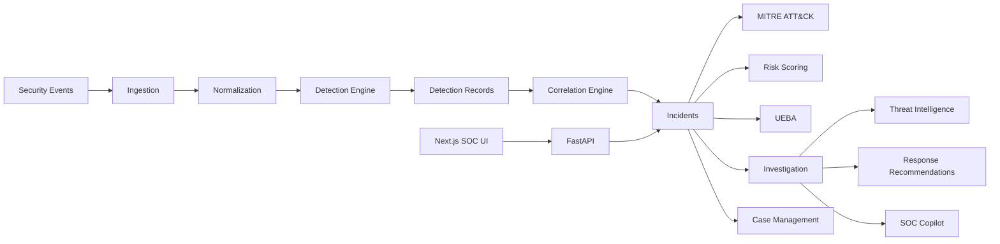

<div align="center">

# ESF CyberShield

**Evidence-grounded Security Operations & Threat Investigation Platform**

Ingest security telemetry, run deterministic detection, correlate signals into incidents,
and investigate each incident with MITRE ATT&CK context, UEBA anomalies, threat-intel
enrichment, analyst recommendations, and a grounded SOC Copilot — all traceable to evidence.

[](backend/requirements.txt)
[](backend/app/main.py)
[](frontend/package.json)
[](frontend/package.json)
[](frontend/tsconfig.json)
[](frontend/package.json)
[](docker-compose.yml)
[](backend/Dockerfile)
[](models/ueba/manifest.json)
[](docker-compose.yml)
[](backend/app/services/mitre/catalog.json)

*Independent portfolio project inspired by SOC/DFIR workflows. Not a production SOC serving real customers.*

</div>

---

## Live demo

| Surface | URL | Description |
|---|---|---|
| Application | https://esf-cybershield-1.onrender.com/ | Next.js SOC dashboard (live UI) |
| API | https://esf-cybershield.onrender.com/ | FastAPI service (`/health`, `/api/v1/...`) |

The demo serves **seeded synthetic demonstration data** (200 events → 20 detections → 12 incidents),
never real customer telemetry. Seeding is explicit and idempotent; the API never seeds on startup.

Key entry points: `/` overview, `/incidents`, `/incidents/[id]`, `/detection-rules`, `/mitre`, `/ueba`, `/events`.

---

## Why ESF CyberShield?

Raw telemetry is not an investigation. Analysts need to know *which events matter*,
*how they connect*, *what attacker behavior they resemble*, *how anomalous they are*,
and *what to do next* — with every claim pointing back to evidence.

ESF CyberShield turns telemetry into traceable analysis:

```
raw security events
→ normalized telemetry
→ deterministic detections
→ correlated incidents
→ evidence
→ ATT&CK context
→ UEBA signals
→ investigation
→ recommended response
→ analyst assistance
```

The central design principle is **evidence traceability**:

```
Security Events
      ↓
Event Ingestion
      ↓
Normalization
      ↓
Detection Engine
      ↓
Correlation
      ↓
Incident
      ↓
MITRE ATT&CK + Risk
      ↓
UEBA
      ↓
Investigation
      ↓
Threat Intelligence
      ↓
Response Recommendations
      ↓
Grounded SOC Copilot
```

---

## Key capabilities

| Capability | What it does |
|---|---|
| Event ingestion | Single/batch ingest with validation; idempotent re-POST returns the stored row |
| Deterministic detection | 8 endpoint/identity rules + 6 network-flow rules; no ML, no LLM in the path |
| Detection evidence | Every detection carries sorted `evidence_event_ids` plus complete `bucket_event_ids` |
| Incident correlation | Union-find over entity, time-window, shared-evidence, and sequence signals |
| Risk scoring | Deterministic 0–100 score with inspectable breakdown and LOW/MEDIUM/HIGH/CRITICAL bands |
| MITRE ATT&CK mapping | Static versioned catalog maps stored detections to technique hypotheses |
| UEBA anomaly detection | Isolation Forest over per-(user, hour) behavior; attached as independent evidence |
| Investigation workspace | Read-only assembly: timeline, entities, per-detection traces, evidence, MITRE, UEBA, risk, case, TI, recommendations, Copilot |
| Case management | `NEW → INVESTIGATING → CONTAINED → RESOLVED` lifecycle, assignee, append-only notes, activity history |
| Threat-intel enrichment | Observable extraction + provider abstraction + TTL cache; local deterministic test provider |
| Response recommendations | Deterministic, hedged, evidence-referenced analyst guidance; executes nothing |
| SOC Copilot | Grounded Q&A over bounded incident context with citation validation |
| Detection rule catalog | UI aggregates persisted detections by rule with firing history |
| MITRE coverage view | UI aggregates stored incident technique mappings |
| UEBA anomaly view | UI aggregates stored incident UEBA evidence |
| Events view | Filterable, paginated query over stored telemetry with raw-JSON inspection |
| PostgreSQL support | Portable types, Alembic migrations 0001–0004, documented deployment variant |
| SQLite support | Local/dev/demo-compatible path with persistent-volume deployment topology |
| Docker deployment | Backend + frontend + (dormant) PostgreSQL + one-off seed profile via Compose |
| Render deployment | Blueprint for frontend → backend → persistent SQLite disk |

---

## SOC workflow

| Step | Stage | Nature |
|---|---|---|
| 1 | Events enter through the ingestion layer | Deterministic |
| 2 | Events are normalized into a common representation; `raw_event` preserved byte-identical | Deterministic |
| 3 | Deterministic rules evaluate telemetry in `(timestamp, event_id)` order | Deterministic |
| 4 | Detections retain evidence references and deterministic UUIDv5 fingerprints | Deterministic |
| 5 | Related detections correlate into incidents via union-find components | Deterministic |
| 6 | Incidents receive MITRE hypotheses and deterministic risk scores | Deterministic |
| 7 | UEBA attaches an independent anomaly signal; risk is intentionally unchanged | ML-assisted |
| 8 | Investigation assembles timeline, entities, evidence, detections, and context (read-only) | Deterministic |
| 9 | Threat intel enriches supported observables (advisory only) | Deterministic lookup |
| 10 | Recommended actions provide hedged analyst guidance with evidence refs | Deterministic |
| 11 | SOC Copilot answers analyst questions from bounded incident evidence | LLM-assisted, grounded |

Deterministic stages always produce identical output for identical input. ML/LLM stages are
explicitly bounded: UEBA never changes risk; Copilot never mutates state.

---

## Architecture



Persistence (`security_events`, `detections`, `incidents`, `incident_notes`,
`incident_activity`) sits behind the API. The frontend never touches the database;
it reads through `GET /api/v1/...`, `PATCH` (case), and `POST` (ingest, notes, Copilot).

---

## System architecture

**Frontend** — Next.js 16, React 19, TypeScript, Tailwind CSS 4. SOC dashboard with
overview KPIs, incident queue and investigation page, case section, detection-rule
catalog, MITRE coverage, UEBA anomalies, events explorer, Copilot panel, recommendations,
and threat-intel cards. Bounded parallel fetch with per-row degradation (one 404 never
fails the page).

**Backend** — FastAPI service layer: ingest, normalize, deterministic detection
(endpoint + flow packages), correlation, MITRE/risk enrichment, UEBA attach, investigation
assembly, playbook recommendations, threat-intel enrichment, Copilot provider abstraction,
case management, and idempotent persistence. Rules never rerun inside read APIs.

**Persistence** — PostgreSQL is the system of record in the data model (portable
`JSONB`/`JSON`, `Uuid`, naive-UTC datetimes; Alembic migrations `0001`–`0004`). SQLite
is the local/demo-compatible path, including the containerized and Render topologies.
The app never migrates or seeds on startup; schema ownership stays with Alembic.

**ML** — Isolation Forest UEBA (`ueba-iforest-v1`, 200 trees, contamination 0.05,
12-feature `ueba-features-v1` over per-(user, UTC-hour) windows). The trained artifact
`models/ueba/model.joblib` is tracked (~2 MB); training is out of scope at runtime
and the API never loads the model file except through the explicit seed path.

**LLM** — Provider abstraction (`LLMProvider`): deterministic offline `FakeLLMProvider`
(`fake-v1`, zero network I/O) by default; `OllamaProvider` joins the registry only when
`OLLAMA_HOST` is configured. The client cannot select providers. Copilot input is the
bounded incident context only — never a raw database dump, never secrets, never other
incidents.

---

## Detection engine

Endpoint/identity rules (`backend/app/services/detect/rules/`):

| Rule ID | Name | Severity | Detection principle |
|---|---|---|---|
| AUTH-001 | Brute Force → Success | HIGH | ≥3 failures + success, same user+IP (fallback user+host), 10-min window, one detection per success |
| AUTH-002 | Unusual Login Time | MEDIUM | Success outside 08:00–20:00 UTC; explicitly not framed as compromise |
| AUTH-003 | New Source IP For User | MEDIUM | IP unseen in the supplied window with ≥3 prior events; window-relative |
| PROC-001 | Suspicious Process Execution | HIGH | Exact-match patterns (shell-from-service-host; encoded-cmdline tokens) with parent constraint |
| PROC-002 | Suspicious Parent-Child | HIGH | Configured pair list (e.g. service → PowerShell), exact basename match |
| NET-001 | Suspicious External Destination | HIGH | Local `iocs.json` match (reserved test ranges); returns the matched record |
| NET-002 | Mass DNS Activity | MEDIUM | ≥100 DNS per host/user in 5 min, non-overlapping windows; volume language only |
| DATA-001 | Abnormal Outbound Transfer | HIGH | Single transfer ≥1 GB; volume-only by design |

Network-flow rules (`backend/app/services/detect/flow/`, label-blind `FlowView` projection):

| Rule ID | Name | Severity | Detection principle |
|---|---|---|---|
| FLOW-001 | High Connection Rate | MEDIUM | Per-destination (or GLOBAL) 60-s flow count vs trailing median baseline |
| FLOW-002 | Repeated Connection Attempts | HIGH | ≥20 short SYN-heavy flows to one service port in 5 min |
| FLOW-003 | Port-Scan-like Behavior | MEDIUM | One source over ≥15 distinct ports in 5 min with dense 60-s accumulation and SYN-probe majority; entropy fallback otherwise |
| FLOW-004 | Flow Byte-Rate Anomaly | MEDIUM | Bucket-median `Flow Byts/s` vs 30-min rolling median (8×, 1 MB/s floor, ≥5-flow buckets) |
| FLOW-005 | Protocol/Port Anomaly | LOW | Session-unseen (protocol, port) pair with minute-level peak volume; novelty tripwire |
| FLOW-006 | DoS-like High-Volume Burst | HIGH | ≥500 flows and ≥50k packets/s aggregate in a 30-s window |

Engineering principles:

- Deterministic rules with centralized config; one failing rule cannot fail a run.
- Time-window processing over event time with inclusive-start/exclusive-end semantics.
- Inputs copied, sorted by `(timestamp, event_id)`; input order never affects output.
- Bounded evidence samples (FLOW caps: 20/20/20/3/5/20) for UI/API safety.
- Complete `bucket_event_ids` preserved alongside capped evidence for honest measurement.
- Detection fingerprints (`rule_id + sorted evidence IDs`) hashed to deterministic UUIDv5 IDs.
- Idempotent event identity: API ingest via UNIQUE `event_id`; flow adapters via UUIDv5 over dataset, adapter version, file, and source row.

---

## Evidence-first design

```
Detection
→ evidence event IDs (bounded sample)
→ bucket event IDs (complete contributor set)
→ incident
→ investigation timeline
→ analyst context
```

Capped **evidence samples** keep API responses and the UI bounded. Complete **bucket
membership** preserves every qualifying contributor for evaluation and audit, so capped
samples never silently become coverage metrics. The investigation endpoint serves at most
`EVIDENCE_SAMPLE_LIMIT = 200` events per incident (sorted, scrubbed of
`evaluation_only` labels); threat-intel and Copilot reuse the same bounded fetch path.

---

## Incident correlation

- Detection-to-incident assembly over memoized, fingerprinted detections sorted chronologically.
- Endpoint branch: same user AND same host AND ≤30-min gap AND (shared evidence event OR a recognized sequence pair such as AUTH-001+PROC-001/002, AUTH-001+NET-001, PROC+NET-001/DATA-001, NET-001+DATA-001, AUTH-001+DATA-001).
- FLOW branch (user/host-absent telemetry): compatible network entity AND ≤30-min network window AND (shared complete `bucket_event_ids` OR a configured FLOW sequence pair). Bare IP/port/protocol/time alone never link; `GLOBAL`/unknown entities never link.
- Union-find components become incidents (singletons included); entity resolution prefers evidence-event columns with rule-metadata fallback; `None`/`unknown` never match.
- Deterministic incident identity (`incident:<sorted detection IDs>` → UUIDv5); reruns and input shuffles are identical. Scoring weights and severity promotion (pairs, 3-chains, full 4-chains) are config-centralized.

---

## MITRE ATT&CK

Stored incident/detection data is projected through a static, versioned catalog
(`catalog_version: project-static-v1`, no live MITRE API, no downloads):

| Rule | Technique | Tactic |
|---|---|---|
| AUTH-001 | T1110 Brute Force | Credential Access |
| AUTH-003 | T1078 Valid Accounts | Persistence |
| PROC-001 (shell-from-service) | T1059 Command and Scripting Interpreter | Execution |
| PROC-001 (encoded indicator) | T1140 Deobfuscate/Decode Files or Information | Defense Evasion |
| PROC-002 | T1059 Command and Scripting Interpreter | Execution |
| NET-001 | T1071 Application Layer Protocol | Command and Control |
| DATA-001 | T1048 Exfiltration Over Alternative Protocol | Exfiltration |

AUTH-002 (off-hours heuristic) and NET-002 (DNS volume) are deliberately unmapped.
FLOW rules have no static mapping in the current catalog, so flow-benchmark incidents
honestly show unavailable MITRE context. Every mapping is a qualified hypothesis
(“potential association”), never proof a technique was used. The MITRE UI page aggregates
only stored mappings (bounded incident-detail fetch), never invented coverage.

---

## UEBA

- Isolation Forest (`n_estimators=200`, `contamination=0.05`, `random_state=42`) on
  standardized per-(user, UTC-hour) features (12 columns: event/auth/failure/IP/
  destination/DNS/byte/process/unusual-hour signals).
- Independent anomaly layer: complements deterministic rules, replaces nothing.
- Per-user baselines with `READY` / `INSUFFICIENT_HISTORY` / `COLD_START` reporting;
  status gates interpretation, never scoring.
- Incident enrichment attaches overlapping, causally-valid observations (entity match,
  window ends at or before `last_seen`, evidence overlap) with max-score/any-flag summary.
- Deterministic risk is intentionally **unchanged** by UEBA (regression-asserted);
  the two are displayed side by side. Anomaly score is not a probability of compromise.
- Tracked model `models/ueba/model.joblib` (`ueba-iforest-v1`) plus `manifest.json`
  (dataset hash, rows, columns, hyperparameters, threshold).

---

## Investigation workspace

`GET /api/v1/incidents/{id}/investigation` returns the read-only contract the UI renders:

- Incident explanation (summary, trigger detections, correlation reason, risk factors, MITRE/UEBA context, explicit unavailable list)
- Ordered detection timeline with evidence and bucket counts
- Entity sets (users, hosts, source/destination IPs, ports, protocols, processes)
- Per-detection traces (reason verbatim, fingerprint, evidence and bucket IDs, technique links)
- Evidence sample (scrubbed events, selectable rows, capped raw JSON)
- Stored MITRE hypotheses, UEBA evidence, and risk breakdown (displayed, never recomputed)
- Case block (status, assignee, allowed transitions, notes, activity)
- Threat-intel and recommendation consumers reuse the same bounded rows

The UI performs no security decisions; missing data is reported as unavailable, never fabricated.

---

## Case management

Implemented lifecycle (`backend/app/services/case.py`):

```
NEW → INVESTIGATING → CONTAINED → RESOLVED
              ↕              ↕
   INVESTIGATING ⇄ CONTAINED (both directions between these two;
   INVESTIGATING → RESOLVED and CONTAINED → RESOLVED allowed; RESOLVED is terminal)
```

- `assignee` (opaque analyst identifier) with `assigned_at` timestamp.
- Append-only analyst notes (non-empty plain text, 5,000-char cap).
- Activity history: `STATUS_CHANGED`, `ASSIGNED`, `UNASSIGNED`, `NOTE_ADDED` with actor and metadata.
- Status changes never reinterpret detection truth; derived pipeline fields are never rewritten by the case layer.
- No RBAC or multi-user collaboration: any caller can invoke the case endpoints.

API: `PATCH /api/v1/incidents/{id}` (status/assignee), `GET`/`POST .../notes`, `GET .../activity`.

---

## Threat intelligence

- Observable extraction from the bounded evidence sample: `ipv4`/`ipv6` (fully supported
  on flow data), `domain`, `url`, `file_hash` (contract-supported; current flow adapters
  emit none, so those incidents honestly yield zero such observables). Usernames, hostnames,
  and process names are deliberately not IOC types.
- Provider abstraction: side-effect-free `lookup(observable)` over the normalized
  `(type, value)` pair only — never raw events, labels, or incident context.
- Only the `local-test` provider ships (`catalog.json`, `local-test-v1`). It matches
  RFC-reserved fixtures (TEST-NET-1/2/3, `2001:db8::/32`, `.invalid`/`example.com`, empty-string
  hash vector) and is bannered in the UI as fixture intelligence — not real threat data.
- Process-local TTL cache (default 3,600 s) keyed by provider, type, and normalized value;
  no new database table.
- Endpoint degrades per-observable to `available: false` instead of failing the investigation.
- **No external live threat-intel network calls exist.** No VirusTotal, AbuseIPDB, MISP, or
  OTX integration is implemented; `docs/threat-intelligence.md` specifies the exact steps a
  future provider must follow (env-only credentials, timeouts, attribution, non-blocking).

---

## SOC Copilot

```
Incident → Investigation → Bounded Copilot Context → System Prompt
→ Delimited Evidence → LLM Provider → Citation Validation → Structured Response
```

- Context is closed, sorted, and capped (100 timeline entries, 100 detections at 25
  evidence refs each, bounded TI/recommendations/notes); benchmark labels, raw payload
  blobs, secrets, other incidents, and arbitrary tables are excluded.
- 12-rule grounding policy with `<INCIDENT_CONTEXT>` delimiters; only
  `[DET|EVID|MITRE|UEBA|TI:...]` citations resolving against the context survive
  (others are dropped and counted).
- Prompt-injection defenses: incident content is untrusted data, never instructions;
  the fake provider is structural template composition and cannot follow embedded directives.
- Deterministic offline `FakeLLMProvider` by default; `OllamaProvider` (stdlib `urllib`,
  single attempt, no retries) only when `OLLAMA_HOST` is configured.
- Limits: 2,000-char questions, 30-s timeout, 1,024 output tokens, temperature 0, one
  provider call per request. Unknown client fields (e.g. provider overrides) are rejected.
- Failures degrade to `503 {"detail": "assistant unavailable"}`; investigation,
  recommendations, TI, and case management are unaffected.
- **Advisory only.** State-change requests receive an explicit refusal; no containment,
  remediation, assignment, or resolution is ever executed.

---

## Datasets & evaluation

Public datasets only, frozen subsets, post-hoc labels. Detectors never consume ground truth.

| Dataset | Frozen subset | Rows | Source SHA-256 |
|---|---|---|---|
| CSE-CIC-IDS2018 | `02-20-2018`, first 1M data rows (`working/02-20-2018-1m.csv`) | 1,000,000 | `5669cfe2…774bcb` |
| CICIDS2017 | Friday PortScan (286,467) + Tuesday brute force (445,909) | 732,376 | `7e2ddaa8…0c45e08`, `ae9c88e1…445815` |

- CSE source archive stays untouched; remaining ~6.9M rows are excluded from all evaluation claims.
- Attack episodes: `DDoS-LOIC-HTTP` (576,191) on CSE; `PortScan` (158,930), `FTP-Patator`
  (7,938), `SSH-Patator` (5,897) on CICIDS2017. Benign: 423,809 (CSE), 559,611 (CICIDS2017).
- Methodology: UUIDv5 event identity, `(timestamp, event_id)` ordering, 50k time-ordered
  chunks with 40-min overlap, FLOW-005 full second pass, deterministic fingerprints,
  byte-identical JSONL reruns, adapter-embedded `evaluation_only` labels with allowlist
  projection, strip/relabel-invariance proofs, and AST leakage scans.
- Three metric levels: **evidence** (capped samples), **bucket** (complete contributor
  sets; TP iff the bucket intersects an episode), **incident** (correlation replay).
  Bucket recall is the honest coverage measure; event recall measures evidence sampling
  (evidence-cap ceiling ≈5% on CSE). No incident FPR is reported (benign episodes are
  not a partition).

Authoritative source: `docs/final-evaluation.md` plus run artifacts under
`evaluation/slice22-1m/6cb7243a7ce9/` and `evaluation/cicids2017-multi-attack-official/f9dde9888580/`.

<details>
<summary>What the numbers do and do not mean</summary>

These are offline benchmark measurements of a deterministic lab pipeline on frozen
public captures — not production accuracy, not recall across attack types, not zero-FP
claims. Volume-sensitive rules pay a documented false-positive price on infra-heavy
traffic; several rules remain unvalidated (no qualifying behavior in these campaigns).

</details>

---

## Benchmark results

Detection layer (evidence-level, capped samples):

| Dataset | Rows | Detections | Precision | Recall | F1 | FPR |
|---|---|---|---|---|---|---|
| CSE-CIC-IDS2018 1M | 1,000,000 | 1,285 (001:306, 003:973, 004:5, 005:1) | 0.0453 | 0.00144 | 0.00279 | 0.0412 |
| CICIDS2017 pair | 732,376 | 492 (001:492) | 0.0514 | 0.00292 | 0.00552 | 0.0166 |

Bucket and incident levels (honest coverage measures):

| Dataset | Rows | Detections | Bucket precision | Bucket recall | Incident precision | Incident recall | Runtime | Episodes | Episodes hit |
|---|---|---|---|---|---|---|---|---|---|
| CSE-CIC-IDS2018 1M | 1,000,000 | 1,285 | 0.0358 (46/1,285) | 1.0 (1/1) | 0.0090 (9/1,001) | 1.0 | 4,128.5 s | 1 | 1 |
| CICIDS2017 pair | 732,376 | 492 | 0.0549 (27/492) | 1.0 (3/3) | 0.0474 (23/485) | 1.0 | 1,148.8 s | 3 | 3 |

Attack-episode coverage:

| Attack | Events | Buckets | Hit | Hit incidents |
|---|---|---|---|---|
| DDoS-LOIC-HTTP | 576,191 | 46 (001×45, 005×1) | yes | 9 |
| PortScan | 158,930 | 15 (001) | yes | 11 |
| FTP-Patator | 7,938 | 7 (001) | yes | 7 |
| SSH-Patator | 5,897 | 5 (001) | yes | 5 |

Per-rule behavior: FLOW-001 is the only rule firing on CICIDS2017 and carries 45/46 CSE
bucket TPs — volume detection generalizes across floods and brute/scan bursts. FLOW-002
and FLOW-006 are silent on both sets (thresholds never reached: unvalidated, not refuted).
FLOW-003’s gates correctly suppress non-probe traffic (all CICIDS2017 PortScan flows carry
SYN count 0); scan recall remains unvalidated. FLOW-004 is narrow/conservative post-redesign.
FLOW-005 fires once per campaign by design (414,902-event TCP/80 flood bucket on CSE).

Limitations: single-campaign-per-dataset recall, minute-resolution 2017 clocks, flow-only
telemetry (no user/host/auth signals), FIN/UDP scan shapes outside the discriminator,
slow-burn and application-layer attacks unaddressed.

---

## Engineering highlights

- Deterministic UUIDv5 identities for flow events, detections, and incidents; UNIQUE-key idempotent ingest.
- Immutable/raw telemetry separation: normalization never alters `raw_event`; rules never read it (AST-enforced).
- Evidence contract: bounded analyst samples plus complete bucket membership, both sorted and deterministic.
- Chronological evaluation with 50k chunks, 40-min overlap, and a FLOW-005 stream-global second pass.
- Post-hoc evaluation labels with adapter allowlists, relabel-invariance, and leakage scans.
- Read-only investigation assembly over persisted rows; scrubbed evidence; explicit unavailable reporting.
- Provider abstractions for threat intel and LLM with safe defaults (local fixture, offline fake).
- Prompt-injection-aware Copilot context with citation validation and refusal of state changes.
- Portable PostgreSQL/SQLite persistence with Alembic-owned schema (migrations `0001`–`0004`).
- Deterministic demo seeding (explicit, idempotent, startup-safe by omission).
- Correlation, risk, UEBA, and benchmark reruns proven byte-identical under rerun and shuffle.

---

## Tech stack

| Layer | Technologies |
|---|---|
| Frontend | Next.js 16.3.4, React 19.2.8, TypeScript 5, Tailwind CSS 4, Vitest 5, Testing Library, ESLint 9 |
| Backend | Python 3.11+, FastAPI, Uvicorn, Pydantic v2, pydantic-settings, SQLAlchemy 2, Alembic, psycopg, httpx, pytest |
| Database | PostgreSQL 16 (system of record; dormant Compose service + documented deploy variant), SQLite (local/demo/deploy topology) |
| ML/UEBA | scikit-learn IsolationForest, joblib artifact, 12-feature hourly behavior model |
| Security/detection | Deterministic rule engine (AUTH/PROC/NET/DATA + FLOW), union-find correlation, static MITRE catalog, deterministic risk, local TI fixture, grounded Copilot |
| Deployment | Docker + Compose, Render blueprint (frontend → backend → persistent disk) |

---

## Project structure

```
.
├── backend/
│   ├── app/
│   │   ├── api/v1/          # health, events, detections, incidents (+investigation/case/TI/recommendations/copilot)
│   │   ├── core/            # config, ingest auth
│   │   ├── db/              # engine, models (security_event, detection, incident, case)
│   │   ├── schemas/         # events, detections, incidents, threatintel, copilot
│   │   └── services/        # ingest, normalize, detect, correlate, mitre, persist,
│   │                        #   investigate, playbooks, threatintel, ueba, copilot, case
│   ├── alembic/versions/    # 0001_security_event → 0004_case_management
│   └── tests/               # 33 test modules
├── frontend/
│   ├── app/                 # /, /events, /incidents, /incidents/[id], /detection-rules, /mitre, /ueba
│   ├── components/          # dashboard, incidents, layout, mitre, rules, ueba, ui
│   └── lib/                 # api-client, types, aggregates, hooks
├── data/
│   ├── public/              # git-ignored benchmark CSVs (never committed)
│   └── synthetic/           # tracked demo fixtures (sample_demo.jsonl, 200 events)
├── models/ueba/             # tracked model.joblib + manifest.json
├── scripts/                 # seed_demo, synthetic generation, dataset adapters, evaluators, pipeline runners
├── evaluation/              # frozen run artifacts (summaries, reports, JSONL)
├── docs/                    # architecture, engines, benchmarks, validation plans
├── docker-compose.yml
├── render.yaml
├── .env.example
└── README.md
```

---

## Local development

Backend:

```powershell
cd backend
python -m venv .venv
.\.venv\Scripts\Activate.ps1
pip install -r requirements.txt
copy ..\.env.example ..\.env
.\.venv\Scripts\python.exe -m alembic upgrade head
.\.venv\Scripts\python.exe -m uvicorn app.main:app --port 8000
.\.venv\Scripts\python.exe -m pytest tests/ -v
```

Interactive API docs: `http://localhost:8000/docs`.

Frontend:

```powershell
cd frontend
npm install
copy .env.example .env.local
# set NEXT_PUBLIC_API_BASE_URL=http://localhost:8000 in .env.local
npm run dev      # http://localhost:3000
npm test         # vitest run
npm run typecheck
npm run lint
npm run build
npm start
```

The frontend never connects directly to PostgreSQL; all data flows through
`NEXT_PUBLIC_API_BASE_URL` (baked at build time).

---

## Demo seeding

Deterministic demo content: **200 events → 20 detections → 12 incidents**
(plus one guarded `demo-analyst` assignee/note on the top-risk incident).

```powershell
$env:DATABASE_URL = 'sqlite:////data/esf.db'
.\.venv\Scripts\python.exe scripts/seed_demo.py
```

Via Compose (after migrating):

```powershell
docker compose run --rm backend alembic upgrade head
docker compose --profile seed run --rm seed
```

Properties: explicit one-off step (never on startup), idempotent re-runs report
`demo data already seeded / nothing to do`, fails clearly without `DATABASE_URL` or
migrated schema, performs zero network I/O, and never references benchmark datasets.

---

## Docker

Services: `backend` (FastAPI + seed assets under `/srv/seed/`), `frontend` (production
build), `postgres` (**dormant** — retained for a future production profile; the app
currently points at SQLite), and a `seed` profile for one-off demo seeding. SQLite lives
on the persistent `esf-sqlite` volume.

```powershell
copy .env.example .env
docker compose config
docker compose up -d
docker compose run --rm backend alembic upgrade head
docker compose --profile seed run --rm seed
```

---

## Render deployment

Blueprint topology (`render.yaml`):

```
Render frontend
      ↓  NEXT_PUBLIC_API_BASE_URL (build-time)
Render backend (/health)
      ↓  DATABASE_URL=sqlite:////data/esf.db
Persistent disk (/data, 1 GB)
```

- Frontend: https://esf-cybershield-1.onrender.com/
- Backend: https://esf-cybershield.onrender.com/
- Environment names only (no values or secrets in the repo): `NEXT_PUBLIC_API_BASE_URL`,
  `DATABASE_URL`, `CORS_ORIGINS`, `APP_ENV`. Sensitive values belong in the Render Dashboard.
- One-off backend shell after first deploy: `alembic upgrade head`, then
  `python /srv/seed/scripts/seed_demo.py`. Changing the frontend API URL rebuilds the
  frontend image; changing `CORS_ORIGINS` only restarts the backend.
- A PostgreSQL (`$0`) variant is documented in `backend/README.md` (same code selected via
  `DATABASE_URL`, UTC-pinned sessions, database-agnostic seed); `render.yaml` intentionally
  remains on the SQLite topology.

---

## Security considerations

- Evidence grounding: detections, incidents, recommendations, and Copilot answers cite stored evidence IDs.
- Bounded AI context: Copilot sees one incident’s capped context — no cross-incident access, no table dumps.
- Prompt-injection defense: untrusted content is delimited data; embedded directives are tested to fail.
- No secrets in Copilot context; prompts/responses are never logged; error paths are sanitized (no SQL/paths/credentials).
- Deterministic detection and correlation; immutable raw telemetry; naive-UTC storage with aware-UTC API.
- Read-only investigation; explicit analyst mutations only (status, assignee, notes).
- Append-only case notes; full activity history for status and assignment changes.
- Deterministic identity (UUIDv5) and idempotent writes prevent duplicate evidence.
- No automatic remediation: recommendations and Copilot are advisory; nothing executes containment.
- No compliance certifications claimed; no CERT-In empanelment claimed.

---

## Limitations

- Public benchmark captures are not enterprise telemetry; results do not transfer to production networks.
- The shipped threat-intel provider is a local RFC-reserved fixture, not a live commercial feed.
- Copilot quality depends on the configured provider; default offline answers are template-bounded.
- Several FLOW rules are unvalidated on current campaigns (no qualifying behavior present) — documented, not tuned around.
- Some rules are intentionally conservative (e.g. FLOW-004’s ≥5-flow buckets, FLOW-005’s peak gate).
- UEBA hour grain misses sub-hour dynamics; cold-start entities use a global fallback; anomaly ≠ maliciousness.
- Case management has no authentication/authorization scoping in this slice.
- Free-tier Render infrastructure carries cold starts and operational limits.
- No automated containment or remediation exists by design.

---

## Future extensions

Clearly **not implemented**; candidates only:

- Live enterprise telemetry connectors (EDR, firewall, proxy, identity, cloud audit)
- Additional threat-intel providers (OTX, MISP, commercial feeds) behind the existing abstraction
- Richer UEBA models (sequence-aware, per-entity thresholds, retraining policy)
- Streaming ingestion with watermarks and keyed state
- Analyst RBAC and per-incident conversation persistence
- Containment integrations (EDR isolate, firewall block) with explicit approval gates
- Distributed event processing for multi-million-event scale
- Expanded ATT&CK analytics (tactic sequencing, coverage heatmaps, hunt hypotheses)

---

## Screenshots

No screenshots are currently committed to the repository. Placeholders for the
recommended sequence (suggested paths under `docs/images/`):

<!-- Add dashboard screenshot: docs/images/dashboard.png -->
<!-- Add incident investigation screenshot: docs/images/investigation.png -->
<!-- Add case management screenshot: docs/images/case-management.png -->
<!-- Add detection rules screenshot: docs/images/detection-rules.png -->
<!-- Add MITRE ATT&CK screenshot: docs/images/mitre.png -->
<!-- Add UEBA screenshot: docs/images/ueba.png -->
<!-- Add events screenshot: docs/images/events.png -->

Capture against the seeded demo (200 events / 20 detections / 12 incidents) so every
screenshot corresponds to reproducible content.

---

## Testing

| Suite | Scope | Command |
|---|---|---|
| Backend | 33 test modules, 491 tests collected (engines, rules, flow, correlation, MITRE/risk, UEBA, persistence, APIs, Copilot, TI, case, adapters, deployment readiness, PG compat, seed determinism) | `cd backend; .\.venv\Scripts\python.exe -m pytest tests/ -v` |
| Frontend | 17 test files (pages, dashboard panels, investigation, case, Copilot, recommendations, TI, layout, UI primitives, API client, aggregates) | `cd frontend; npm test` |
| TypeScript | Strict `tsc --noEmit` | `cd frontend; npm run typecheck` |
| ESLint | Next.js flat config | `cd frontend; npm run lint` |
| Production build | Next.js production build + start | `cd frontend; npm run build; npm start` |
| Migrations | Alembic upgrade/downgrade; PG-compat and Render/deploy readiness tests | `cd backend; .\.venv\Scripts\python.exe -m alembic upgrade head` |

Benchmark reruns are deterministic: identical inputs yield byte-identical `detections.jsonl`
and `incidents.jsonl` (proven on CICIDS2017; CSE historically consistent), with AST and
relabel-invariance leakage gates green.

---

## Author / project

- Repository: https://github.com/Abdulbasith0512/esf-cybershield
- Live application: https://esf-cybershield-1.onrender.com/
- API service: https://esf-cybershield.onrender.com/
- Project: ESF CyberShield — evidence-grounded security operations & threat investigation platform.

---

## License

No `LICENSE` file is currently present in the repository, so no license is stated here.
Add one (e.g. MIT/Apache-2.0) before public reuse if open-sourcing is intended.
